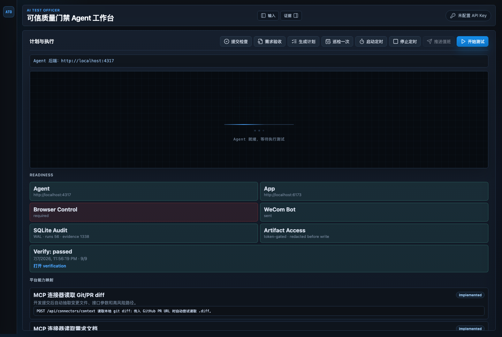
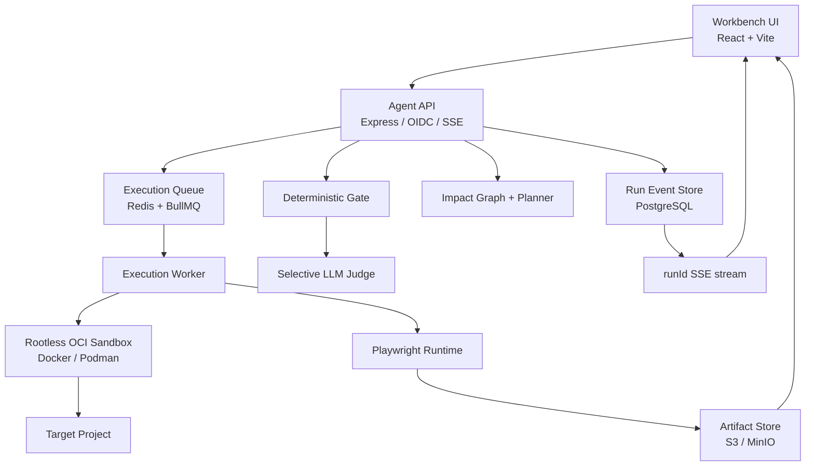

# AI Test Officer

> 一个以真实执行和可追溯证据为核心的 AI 测试工作台：选择项目、描述需求、确认计划，让系统在隔离沙盒中启动项目、执行浏览器路径、采集证据并给出可信裁决。

[](https://nodejs.org/)
[](https://www.typescriptlang.org/)
[](https://playwright.dev/)
[](https://www.docker.com/)



## 这个项目解决什么问题

传统自动化测试通常要求测试人员提前维护脚本、选择器和固定用例；通用 AI Agent 又容易出现“计划写得很好，但没有真实执行”“存在截图文件，所以错误地判定通过”等可信度问题。

AI Test Officer 将这两类能力组合成一条受控链路：

1. 读取自然语言需求、代码目录、Git diff、缺陷单、PR 或 OpenAPI。
2. 分析项目技术栈、页面路由、接口、组件和代码影响面。
3. 用确定性场景和可选 LLM 生成可审核的测试计划。
4. 自动准备隔离运行环境并启动被测项目。
5. 使用 Playwright 执行浏览器路径。
6. 采集 screenshot、DOM、network、console、Trace 和运行日志。
7. 由确定性 Gate 决定机器结论，LLM 只补充复杂归因和证据解释。
8. 将结论关联回具体 run、scenario、attempt、step、Evidence 和 Artifact。

它不是一个“输出测试建议文本”的聊天机器人，也不会仅凭任务完成状态宣布测试成功。

## 核心工作流


Workbench 将“项目接入、测试规划、执行现场、证据复核、Judge 和人工裁决”放在同一页面。被测页面显示在中央内置浏览器区域，项目不会主动打开外部浏览器窗口。

## 主要能力

### 1. 面向普通用户的项目接入

- 通过系统文件选择器选择项目文件夹。
- 展示类似 Finder 的目录树。
- 自动识别 package manager、框架、启动命令、端口和登录能力。
- 识别完成后只把可修改的推荐值显示为表单；稳定的扫描结果以只读信息展示。
- 历史项目可以重新选择，机器绝对路径不会提交到 Git。
- “诊断并运行”负责准备环境、启动项目并等待健康检查，不会直接开始自动化测试。

### 2. 通用沙盒运行

外部项目默认进入 Docker/Podman OCI 沙盒：

- 非 root 用户运行。
- 源码只读挂载。
- 独立 loopback 临时端口。
- 限制 CPU、内存、PID、时间、日志和产物大小。
- 不挂载宿主 Docker socket、SSH、云凭据或用户密钥目录。
- 拦截项目配置中的 `open` / `xdg-open`，避免弹出外部浏览器。
- Agent 重启后可以重新发现并接管仍在运行的受管容器。
- stop/cancel 会终止项目进程和对应容器，而不是只修改前端状态。

当前自动识别路径覆盖：

| 生态 | 自动识别示例 |
| --- | --- |
| Node.js | npm、pnpm、yarn、Vite、Next.js、React、Vue、Svelte、Express、workspace/monorepo |
| Python | pip、uv、Poetry、FastAPI、Django、Flask、Streamlit、Gradio |
| Go | `go.mod` / `go run` |
| Rust | Cargo |
| Java | Maven、Gradle、Spring Boot、wrapper |
| Ruby | Bundler、Rails |
| PHP | Composer、Laravel |
| 静态站点 | `index.html` + 内置静态服务器 |

项目依赖外部数据库、私有 registry、系统服务或必要凭据时，系统会显示明确 blocker，不会偷偷退回宿主机执行。

### 3. 依赖与源码缓存

第一次遇到新的依赖图时，系统必须真实安装依赖；之后不会每次重复安装：

- 按运行镜像、安装命令、lockfile 和嵌套 workspace 依赖清单计算缓存指纹。
- 使用 Docker/Podman 原生持久卷保存依赖，避免 macOS bind mount 写入大量小文件的性能问题。
- Git 项目通过 Git 索引快速计算源码状态。
- 非 Git 项目使用稳定的文件元数据指纹。
- 源码未变化时跳过目录复制。
- 代码变化但依赖未变化时只刷新源码，继续复用依赖。
- npm、pnpm、yarn、pip、Go、Cargo、Maven、Gradle、Bundler 和 Composer 使用各自的项目隔离缓存。
- Agent 热更新或重启不会造成同一项目被重复启动。

缓存只在同一项目安全边界内复用，避免一个不可信项目读取另一个项目的私有依赖。

### 4. 对话式测试规划

用户可以直接输入：

```text
全面灰度测试，重点检查登录、权限、数据刷新、长任务状态和报告生成。
```

系统会先使用低成本的确定性能力完成：

- 代码目录和技术栈扫描；
- 路由、组件、接口和 OpenAPI 发现；
- 已验证场景匹配；
- 代码影响图；
- 风险和证据需求生成。

只有在需求含糊、场景无法匹配、多页面状态复杂或证据冲突时，才调用 LLM。这样形成“规则负责安全底线，AI 负责复杂推理”的分层架构。

Planner 输出必须通过 Action DSL、capability、selector、route、oracle、evidence 和预算编译。不能执行的自然语言步骤不会直接进入浏览器队列。

### 5. 真实浏览器执行

浏览器 Runtime 支持：

- 每个 attempt 独立 BrowserContext；
- Trace 覆盖完整 attempt；
- 按 step 截图和 DOM；
- network、console、dialog、popup 和多标签页事件；
- iframe、上传、下载和浏览器权限；
- 移动端 viewport；
- 离线和慢网络；
- 可取消的步骤与资源预算；
- selector 漂移、页面关闭、目标不可达等失败分类。

即使步骤失败，系统也会先尽力提交 Trace、DOM、截图和失败 Evidence，再写终态，避免“失败后什么证据都没有”。

### 6. Artifact v2 证据链

正式 Artifact 包含：

- `runId`
- `scenarioId`
- `stepId`
- `attemptId`
- `attempt`
- `origin`
- SHA-256
- 文件大小和 media type
- `capturedAt`
- collector 名称和版本
- storage URI
- 统一事件序号

证据来源区分：

| origin | 正式 Gate 用途 |
| --- | --- |
| `runtime-captured` | 可作为正式运行证据 |
| `fixture` | 只能证明输入和前置状态 |
| `user-uploaded` | 需要根据策略验证 |
| `simulated` | 不能满足正式核心证据 |
| `legacy-unverified` | 仅历史查看 |

Artifact 使用“临时写入 → 摘要/大小校验 → 原子提交 → 元数据登记”的流程。报告只引用已提交 Artifact ID，不以一个看似存在的本地路径作为通过依据。

### 7. 可信裁决语义

每次运行不会只显示一个 `completed`，而是拆分为：

| 字段 | 含义 |
| --- | --- |
| `schedulingCompleted` | 调度流程已结束 |
| `executionStarted` | 浏览器或命令执行已开始 |
| `executionSucceeded` | 执行器没有发生环境/脚本级中断 |
| `requirementCovered` | 必需路径和 oracle 均被执行 |
| `requirementPassed` | 已覆盖且业务断言通过 |
| `artifactIntegrityVerified` | Artifact 类型、摘要、大小和关联通过 |
| `evidenceGrounded` | 结论引用了有效 Evidence |
| `gateEligible` | 机器结论拥有完整执行和证据基础 |
| `machineGate` | 确定性机器结论 |
| `judgeRecommendation` | Judge 风险解释和归因建议 |
| `humanDecision` | 审核者决定和原因 |
| `finalStatus` | Workbench、CLI 和 CI 共同消费的最终状态 |

正式状态固定为：

```text
pass | fail | blocked | needs-human-review
```

安全规则：

- 需求未覆盖不能 `pass`。
- 核心步骤未执行不能 `pass`。
- Artifact 缺失、损坏或关联不一致不能 `pass`。
- 业务断言失败但证据完整时，应是可审计的机器 `fail`，不是“证据不完整”。
- LLM 不能把机器 `fail` 或 `blocked` 升级为通过。
- LLM 超时、非法 JSON 或无效 Evidence ID 只记为模型失败，不覆盖机器事实。
- `test-command` 是覆盖基线，没有浏览器运行证据时不能作为正式通过。

### 8. 选择性 LLM Planner / Judge

系统支持 OpenAI-compatible provider。当前适配包含：

- `/responses` 流式 JSON；
- 流式重试；
- 同一 `/responses` 的非流式 JSON 回退；
- `response.completed` 完整性验证；
- 输入/输出 token、延迟、request ID 和错误分类；
- Planner/Judge 独立调用次数、超时和 token 预算；
- API key 加密存储；
- 不记录 Authorization header、明文 key 或完整敏感 Prompt。

Judge 默认只在以下情况调用 LLM：

- 同一 attempt 中存在相互矛盾的证据；
- 规则层结论冲突；
- 失败已确定，但规则无法可靠归因；
- 需求语义存在真实歧义。

证据完整且机器断言明确时，确定性 Judge 直接给出结论，不为“显得更 AI”而额外调用模型。

## 系统架构



正式运行入口：

```http
POST /v1/runs
```

控制事件：

```http
POST /v1/runs/:id/plan-approval
POST /v1/runs/:id/permissions
POST /v1/runs/:id/pause
POST /v1/runs/:id/resume
POST /v1/runs/:id/cancel
POST /v1/runs/:id/decision-override
GET  /v1/runs/:id
GET  /v1/runs/:id/events
GET  /v1/runs/:id/artifacts
GET  /v1/runs/:id/report
GET  /v1/runs/:id/stream
```

SSE 和轮询都按 `runId` 工作，不依赖全局 latest-run。

## 仓库结构

```text
ai-test-officer/
├── agent/                         Agent API、状态机、Planner、Judge、项目适配
├── packages/
│   ├── contracts/                 Zod 契约和版本化协议
│   ├── execution-worker/          OCI 调度、预算、取消和缓存
│   ├── playwright-runtime/        浏览器执行和 Artifact 采集
│   └── desktop-runtime/           桌面适配器接口（非当前发布重点）
├── workbench-ui/                  React/Vite 测试工作台
├── app-under-test/                本地任务管理演示应用
├── fixtures/                      Todo、Order、Customer Portal 独立 fixture
├── data/
│   ├── scenarios/                 版本化场景和 oracle
│   ├── benchmark/                 开发集、盲测输入和执行映射
│   └── projects/                  仓库内置项目配置
├── evaluation/                    隔离 evaluator 标签
├── deploy/production-acceptance/  PostgreSQL/Redis/MinIO/Keycloak 验收栈
├── docs/                          架构、安全、Benchmark 和演示文档
├── scripts/                       开发服务、验收、清理和报告脚本
└── native/                        macOS helper 原型
```

## 快速开始

### 环境要求

- Node.js 20+
- npm 10+
- Docker Desktop 或 Podman（外部项目沙盒必需）
- Playwright Chromium

### 安装

```bash
git clone https://github.com/ZZX0109/ai-test-officer.git
cd ai-test-officer
npm ci
npx playwright install chromium
cp .env.example .env
npm run init:local-config
```

`init:local-config` 在项目外创建本地 master key，并生成被 Git 忽略的本地配置。不要把 `.env`、master key、LLM API key 或 `config/local-secrets.json` 提交到仓库。

### 一条命令启动

```bash
npm run dev
```

开发服务由 supervisor 统一维护：

| 服务 | 默认地址 |
| --- | --- |
| Agent API | <http://127.0.0.1:4317> |
| Demo App API | <http://127.0.0.1:6172> |
| Demo App Web | <http://127.0.0.1:6173> |
| Workbench | <http://127.0.0.1:6174> |

健康检查和停止：

```bash
npm run health:check
npm run stop:dev
```

如需静默后台启动：

```bash
npm run dev:background
```

## 第一次使用

1. 打开 <http://127.0.0.1:6174>。
2. 在项目接入区域选择已有项目，或点击“上传新项目”选择本地文件夹。
3. 点击“识别项目”。
4. 检查系统识别出的技术栈、启动入口和运行建议。
5. 点击“诊断并运行”。
6. 首次准备新依赖图时等待沙盒安装；相同依赖后续直接复用。
7. 在“测试计划”对话框中用自然语言描述目标。
8. 审核系统列出的业务流程、风险、oracle 和证据要求。
9. 确认计划和权限后开始自动化测试。
10. 在中央内置浏览器观察执行，并在右侧查看证据和最终裁决。

“识别项目”不需要 LLM API key；LLM 只用于复杂规划、启动失败解释和选择性 Judge。

## 配置 LLM

在 Workbench 右上角打开 API Key 配置：

1. 点击“添加新的 API Key”。
2. 填写 profile 名称。
3. 选择 OpenAI-compatible provider。
4. 填写 Base URL、模型和 API key。
5. 保存并运行连接测试。
6. 将验证通过的 profile 设为活动模型。

凭据写入本地加密 credential store，不写入源码、`.env`、报告或日志。若 key 曾在聊天、截图或终端中明文出现，应立即在 provider 控制台轮换。

本地 OpenAI-compatible 模型可参考 [本地模型说明](docs/local-openai-compatible-models.md)。

## 常用命令

```bash
npm test                         # 全 workspace 单元、合同和组件测试
npm run typecheck                # 全 workspace 类型检查
npm run build                    # 生产构建
npm run demo:verify              # Demo 证据链验证
npm run test:unified-run         # /v1/runs 完整运行闭环
npm run test:credibility-browser # 浏览器可信度专项
npm run acceptance:production    # 完整生产 Compose 验收
npm run contracts:generate       # OpenAPI 和 Workbench 类型生成

npm run benchmark:run
npm run benchmark:evaluate
npm run benchmark:recompute-history

npm run reports:retention
npm run reports:retention:archive
```

运行产物写入被 Git 忽略的 `reports/`，包括截图、Trace、DOM、日志、评估结果和后台进度。

## Benchmark 与 AI 增益

Benchmark 不是“能调用模型就算完成”，而是比较五条独立通道：

1. test-command baseline；
2. 规则计划 + deterministic Judge；
3. LLM Planner + deterministic Judge；
4. 规则计划 + LLM Judge；
5. Full LLM。

每条记录必须关联真实 run、attempt、Artifact v2、Evidence、机器 Gate 和模型调用。调度完成不能代替需求覆盖或正确裁决。

评估指标包括：

- task success；
- Macro-F1；
- product-bug precision / recall；
- false release / false block；
- human review rate；
- plan executability；
- requirement coverage；
- Artifact / Evidence integrity；
- model failure 和 transport fallback；
- latency、token 和成本；
- 多次重复的一致性和置信区间。

盲测标签只挂载给 evaluator，Agent、API、worker 和 Prompt 无法读取。历史 Poe 数据仅作为只读审计，不进入当前活动模型分母。

如果模型没有超过规则基线或稳定性不达标，报告必须显示：

```text
development_only
llm_gain_not_proven
```

产品默认定位是“规则安全底座 + 选择性 AI 增强”，不会为了比赛展示而隐藏失败样本。

详细方法见：

- [Evidence-Grounded Testing](docs/evidence-grounded-method.md)
- [Judge Evaluation](docs/judge-evaluation.md)
- [Benchmark Report](docs/benchmark-report.md)
- [Research-Grounded Reliability Architecture](docs/research-grounded-reliability-architecture.md)

## 生产验收

本地生产验收栈位于 `deploy/production-acceptance/`，包含：

- PostgreSQL：事件和状态唯一事实源；
- Redis：BullMQ 投递和控制消息；
- MinIO：Artifact 对象存储；
- Keycloak：OIDC/JWT；
- Agent API；
- execution worker；
- fixture targets。

启动验收前：

```bash
cp deploy/production-acceptance/.env.example \
   deploy/production-acceptance/.env
```

替换示例凭据后运行：

```bash
npm run acceptance:production
```

验收覆盖 OIDC、组织隔离、幂等创建、任务入队、active-attempt 唯一性、lease、暂停/恢复/取消、服务重启、Artifact 提交和失败回滚。Docker 不可用时结果是 `blocked`，不会回退 SQLite 后声称生产通过。

## 环境变量

| 变量 | 说明 |
| --- | --- |
| `HOST` / `PORT` | Agent 监听地址和端口 |
| `VITE_AGENT_API_URL` | Workbench 使用的 Agent API |
| `AGENT_API_TOKEN` | 仅 loopback 开发模式使用 |
| `AGENT_MASTER_KEY_FILE` | 本地 credential store master key |
| `DATABASE_URL` | 生产 PostgreSQL |
| `REDIS_URL` | 生产 Redis/BullMQ |
| `OIDC_ISSUER` | OIDC issuer |
| `OIDC_AUDIENCE` | API audience |
| `OIDC_JWKS_URL` | JWT key endpoint |
| `ARTIFACT_S3_BUCKET` | Artifact bucket |
| `ARTIFACT_S3_ENDPOINT` | S3/MinIO endpoint |
| `BENCHMARK_SOPHNET_CREDENTIAL_ID` | Benchmark 使用的加密凭据 ID |
| `BENCHMARK_EXPERIMENT_ID` | 不可变实验 ID |
| `BENCHMARK_LABELS_ROOT` | 仅 evaluator 可读取的标签目录 |

完整示例见 [.env.example](.env.example)。

## 安全设计

- requirements、diff、PR、DOM、console 和 network 都视为不可信输入。
- Planner 只能输出受限 Action DSL，不能生成任意 shell 命令。
- 命令使用 `{ executable, args, cwd, env, timeoutMs }`，不接受生产 shell 字符串。
- connector 对 Content-Length、Content-Type、重定向、最终域名和总字节数执行限制。
- 项目路径必须处于允许的 workspace 或显式外部项目边界。
- API key 和登录测试账号使用加密存储。
- 日志、stdout/stderr 和报告经过脱敏。
- 未知代码默认无宿主 socket、无 SSH、无云凭据、无用户密钥目录。
- 模拟或旧版未验证 Artifact 不能满足正式 Gate。

威胁模型见 [docs/security-threat-model.md](docs/security-threat-model.md)。

## 当前边界

- 首次遇到新的依赖组合仍需真实下载和安装；系统只能缓存和复用，不能凭空省略依赖。
- 需要数据库、消息队列、GPU、系统扩展或私有 registry 的项目，仍需通过 manifest/Secret 提供受控服务。
- 内置浏览器是 Workbench 的可视化表面；Playwright 执行仍发生在隔离 BrowserContext 中。
- macOS 桌面 helper 不是当前 Web 测试发布门槛；没有签名和系统权限时 desktop capability 为 `blocked`。
- LLM 建议不能替代确定性断言、证据完整性和人工发布责任。

## 参与开发

提交前建议执行：

```bash
npm ci
npm test
npm run typecheck
npm run build
npm run demo:verify
git diff --check
```

新功能应同时补充：

- contracts/schema；
- 状态迁移；
- 正向和失败测试；
- Artifact/Evidence 关联；
- 用户可理解的错误信息；
- 不依赖 LLM 的安全降级路径。

## 免责声明

AI Test Officer 提供质量验证、风险解释和证据整理能力，不替代测试工程师、开发负责人或发布审核人的最终判断。对于金融、医疗、安全和其他高风险系统，应建立独立人工审核、最小权限和专用测试数据环境。
